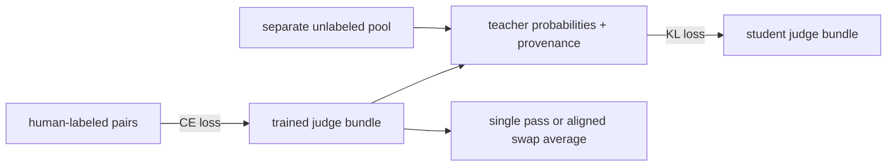

<p align="center">
  
</p>

<div align="center">

[](https://github.com/DaoyuanLi2816/pairjudge/actions)
[](https://pypi.org/project/pairjudge/)

[](LICENSE)
[](https://www.kaggle.com/competitions/lmsys-chatbot-arena/leaderboard)

</div>

`pairjudge` compares a prompt and two responses, returning **A wins / B wins / tie** probabilities, retained-content diagnostics and an optional comparison in both presentation orders. Load a trained, versioned example directly after installation, or train a judge on your own preferences.

The methods originated in the **4th-place, gold-medal solution** to [LMSYS — Chatbot Arena Human Preference Predictions](https://www.kaggle.com/competitions/lmsys-chatbot-arena/overview). The new 0.5B example is a small, separately evaluated model; the competition medal is not its quality certification.

[**Example model**](https://huggingface.co/DaoyuanLi/pairjudge-qwen2.5-0.5b-v0.3) · [**Evaluation and costs**](docs/evaluation.md) · [**User guide**](docs/usage.md) · [**Artifact contract**](docs/artifacts.md) · [**Migration from 0.2**](docs/migration.md)

## Install and compare

Model inference and training use Python **3.10+**. The lightweight core supports Python **3.9+**, with no Torch requirement. First inference downloads approximately **2 GB** of safe model weights and tokenizer files; CPU FP32 uses more memory than the weights. The public FP32 merged bundle also defaults to FP32 on CUDA, preserving its tested merge behavior. You can request CPU explicitly.

```bash
python -m pip install "pairjudge[judge]==0.3.0"
pairjudge compare --prompt "Why does ice float?" --a "Its crystal structure lowers its density." --b "Cold objects always rise." --swap
```

The built-in model reference pins an exact Hub commit. Output is JSON with probabilities, verdict, model revision, dtype, mode and per-field truncation diagnostics. **Probabilities are uncalibrated.** A numerical tie at the maximum is reported as `ambiguous`; the learned `tie` class is a separate outcome.

```python
from pairjudge import PairwiseJudge, from_pairs
from pairjudge.catalog import DEFAULT_MODEL, DEFAULT_REVISION

judge = PairwiseJudge.from_pretrained(DEFAULT_MODEL, revision=DEFAULT_REVISION, device="cpu")
pairs = from_pairs(["Why does ice float?"], ["Its crystal structure lowers its density."], ["Cold objects always rise."])
print(judge.predict(pairs, swap_debias=True))
```

## Batch and local demo

```bash
pairjudge batch --input pairs.jsonl --output results.jsonl --swap
pairjudge demo
```

JSONL accepts strings for single-turn inputs or equal-length string lists for multi-turn inputs. IDs and order are preserved, including duplicate IDs. `--offline` reuses downloaded files; `--model`, `--revision`, `--device` and `--cache-dir` control loading. Existing output files are protected.

```json
{"id":"example-1","prompt":"Explain gravity simply.","response_a":"Mass attracts mass.","response_b":"Objects fall because they want to rest."}
```

Open `http://127.0.0.1:7860` after the model loads. The local demo shows single-pass, swapped-and-aligned, and averaged probabilities, plus the content retention report. It binds loopback, bounds request size, serializes inference, treats text as data and does not upload or log your conversations. [More examples and errors](docs/usage.md).

## What the library provides

**Budget-aware multi-turn packing.** `balanced_v2` reserves field titles and final instructions separately, allocates the remaining content budget with configurable weights, and redistributes unused space. Nonempty fields retain content tokens when a round fits; cuts and dropped rounds are explicit. This is a retention contract, not a guarantee that a short excerpt preserves every fact needed to judge.

<table>
  <tr>
    <th align="left" colspan="8">One packed example — fixed <code>max_length</code> token budget</th>
  </tr>
  <tr>
    <td align="center" rowspan="2">&nbsp;<code>BOS</code>&nbsp;</td>
    <td align="center" colspan="3"><b>Round 1</b> — fits in full</td>
    <td align="center" colspan="3"><b>Round 2</b> — over budget → proportional truncation</td>
    <td align="center" rowspan="2">verdict<br>prompt<br>+ <code>EOS</code></td>
  </tr>
  <tr>
    <td align="center">prompt</td>
    <td align="center">response&nbsp;A</td>
    <td align="center">response&nbsp;B</td>
    <td align="center">prompt&nbsp;<code>……</code><br><sub>20% of remainder</sub></td>
    <td align="center">response&nbsp;A&nbsp;<code>……</code><br><sub>40% of remainder</sub></td>
    <td align="center">response&nbsp;B&nbsp;<code>……</code><br><sub>40% of remainder</sub></td>
  </tr>
</table>

A truncated round needs at least `min_tail_budget` content tokens (default 80). If no usable response content fits, inference fails instead of scoring framing alone. Empty/identical answers produce diagnostics; no historical fixed-probability heuristic is enabled. Legacy `competition_v1` retains the original algorithm and its limitations.

**Swap diagnostics.** Scoring `(A,B)` and `(B,A)`, exchanging A/B output columns and averaging produces **swap-equivariant probabilities** in deterministic inference. This does not establish better accuracy, calibration, or freedom from other biases. See the paired quality intervals and measured cost in the [evaluation](docs/evaluation.md).

**Three-class training and distillation.** Hard labels use cross-entropy; soft distributions use KL. Both are normalized by the actual number of examples in each accumulation group, including its last partial group. Trained heads, tokenizer, all packer fields and class mapping travel together in safe model bundles.



```bash
python -m pip install "pairjudge[train]==0.3.0"
python -m pairjudge.training --cfg examples/configs/quickstart.yaml
python -m pairjudge.pseudo_label --model ./output/judge-quickstart/merged --data pool.parquet --out pool_pl.parquet --swap-debias
```

Training needs your own canonical data and a pinned backbone revision. [Training and the two-phase example](docs/training.md) explains grouped validation, metadata, precision and the single-device scope. Exported bundles are inference artifacts, not optimizer-resume checkpoints. Existing output directories are never overwritten.

## New example model and historical evidence

The public example fine-tunes Apache-2.0 [Qwen2.5-0.5B-Instruct](https://huggingface.co/Qwen/Qwen2.5-0.5B-Instruct) on Apache-2.0 [Arena human preferences](https://huggingface.co/datasets/lmarena-ai/arena-human-preference-55k), using frozen groups and unchanged human labels. It is intended for local experimentation and measured A/B diagnostics, not high-stakes decisions or a replacement for human evaluation. Results, exact revisions, split IDs, paired intervals, costs and failures are in the [report](docs/evaluation.md). No new distillation quality gain is claimed.

On 1,000 frozen test rows (889 groups), the validation-selected example scores
**1.06681 → 1.05855 log-loss** and **41.6% → 45.2% accuracy** with swap averaging.
The paired accuracy difference is +3.6 points (95% group-bootstrap interval
+1.03 to +6.25 points). On a shared RTX 4080, FP32 single/dual latency is about
48/99 ms for one pair. Tie recall remains low, 547 rows are truncated, and two
seeds differ materially; read the report before relying on a verdict.

The **historical 0.2 experiment** recorded 1.0496 → 1.0462 log-loss, 45.6% → 45.1% accuracy and 29.2% single-pass verdict flips on 2,000 held-out rows, after 16k training pairs on an RTX 4080 (~25 minutes). Its [script](examples/position_bias_experiment.py) used unpinned downloads and a random row split with aggregate-only output. These numbers remain historical diagnostics, with no paired uncertainty or grouped test guarantee; they are not the new model's acceptance threshold. Use the 0.2 source/API to inspect that historical experiment.

## Provenance and support

The original scripts, configs, inference notebook, certificate and write-up remain untouched in [competition/](competition/README.md). Golden tests check **1,500 conversations** against [the original tokenizer](tests/reference_impl.py) under explicit `competition_v1`, rather than applying a historical equivalence claim to the new format.

Actual offline CPU tests train hard/soft models, check changed classifier tensors, reload adapter/full bundles in fresh processes, restore nondefault templates/classes and exercise CLI/HTTP paths. Core and model dependency combinations are distinguished in [compatibility and limitations](docs/limits.md). [Contributing](CONTRIBUTING.md) covers reproducible bugs, model behavior reports and useful external evaluations.

Code is **MIT**. Example weights and their base/data provenance are **Apache-2.0**, with third-party notices retained in the model repository. See the [model card](https://huggingface.co/DaoyuanLi/pairjudge-qwen2.5-0.5b-v0.3) for exact applicability.

<p align="center">
  <a href="https://www.kaggle.com/certification/competitions/distiller/lmsys-chatbot-arena">
    
  </a>
</p>

## Citation

```bibtex
@misc{li2024pairjudge,
  author = {Daoyuan Li},
  title  = {pairjudge: pairwise LLM judges with budget-aware packing and position-bias correction},
  year   = {2024},
  url    = {https://github.com/DaoyuanLi2816/pairjudge},
  note   = {Generalized from the 4th-place solution, Kaggle LMSYS Chatbot Arena Human Preference Predictions}
}
```

## License

MIT — see [LICENSE](LICENSE).

## Author

Daoyuan Li — [Kaggle (distiller)](https://www.kaggle.com/distiller) · lidaoyuan2816@gmail.com
